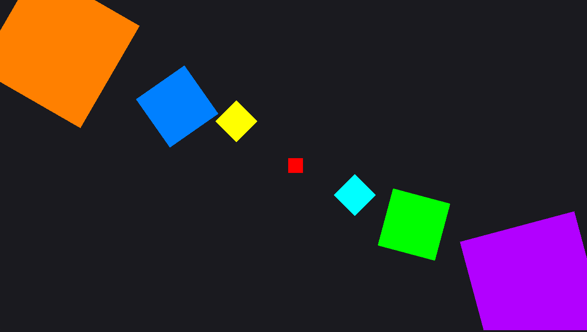
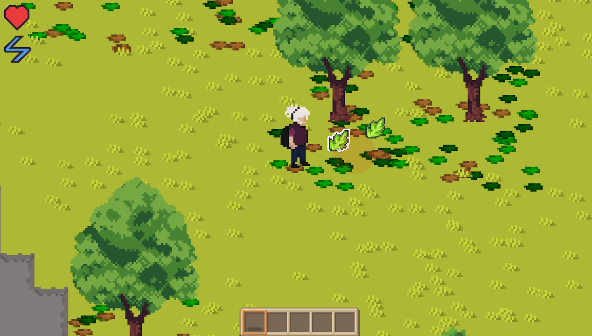
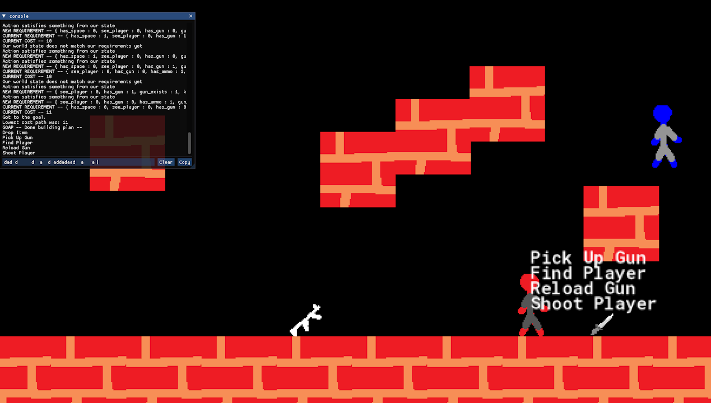
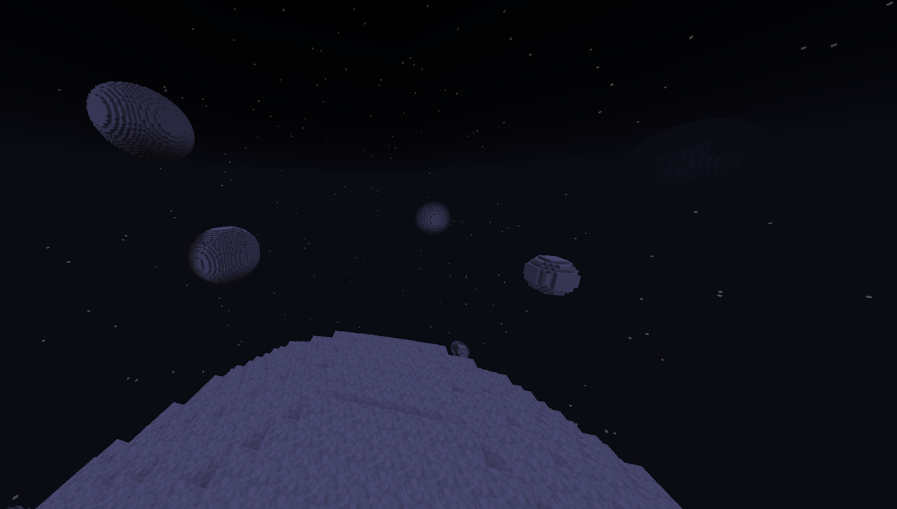

## Hi, I'm Adam.

**I'm an applied mathematics student and aspiring graphics programmer.**

While I have been into game development for a large part of my life, I've recently discovered a strong interest in mathematics and graphics programming.

#### [My GitHub](https://github.com/adam-mathe/adam-mathe.github.io)

## Technical Skills

| Category | Skills |
| :--- | :--- |
| **Programming** | `C/C++`, `Java`, `OpenGL`, `SDL`, `GLSL` |
| **Math** | `Linear Algebra`, `Calculus`, `GLM` |
| **Tools** | `Git`, `RenderDoc` |

## My Favorite Projects

|  |  |
| :---: | :---: 
| [Rainstorm Framework](/portfolio/rainstorm) | [Cadaver Rewrite](/portfolio/cadaver-rewrite) |
|  | 
| [3D Rendering Prototypes](/portfolio/3d) | [Cadaver](/portfolio/cadaver) |
|  |  |
| [Game AI Prototypes](/portfolio/ai) | [Space Survival](/portfolio/space) |
