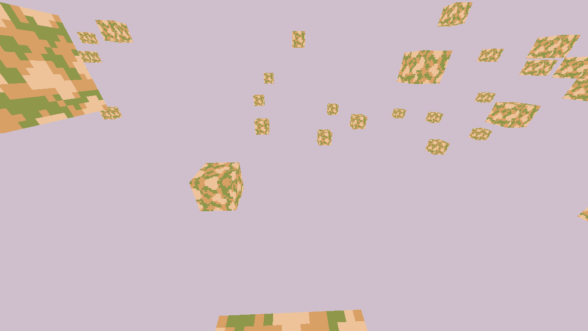
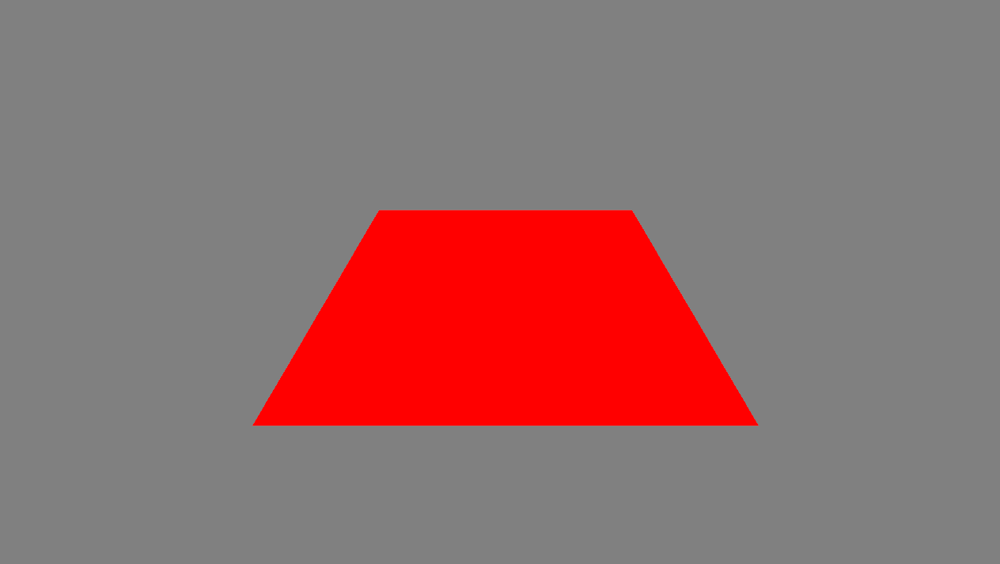
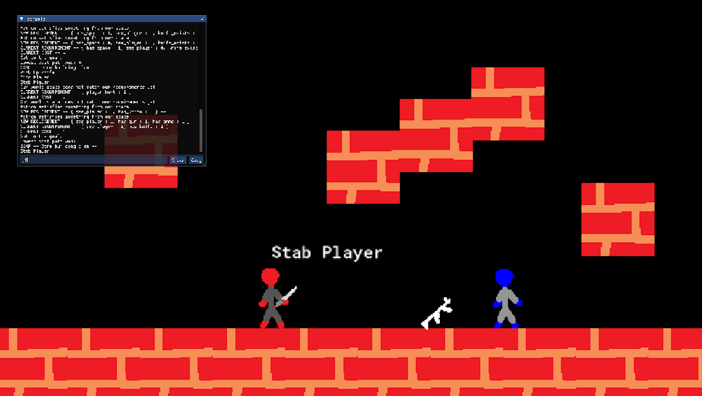
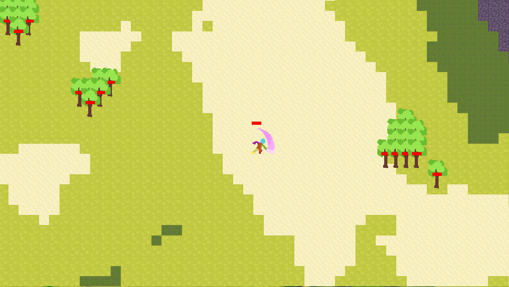
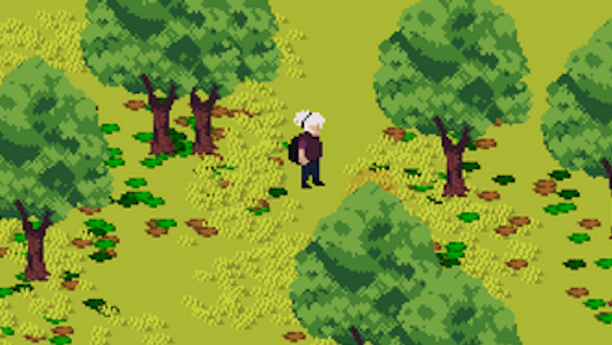
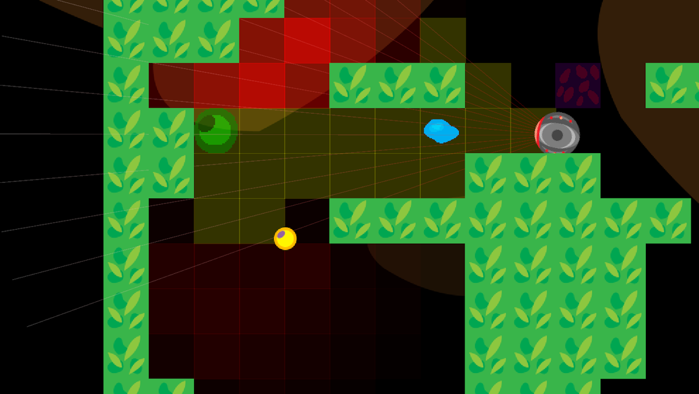

## Hi, I'm Adam.

**I'm an applied mathematics student and aspiring graphics programmer.**

Since I was super young, I've always wanted to make games, and I eventually made *many*. 

I had my first part time work as a software engineer at a mobile game company in highschool. Eventually though, in community college, I would discover a passion for physics and applied mathematics I couldn't ignore. 

Nowadays, I'm completely focused on **graphics programming**. I find to be the perfect blend of challenging and interesting mathematics and game development.

## Technical Skills

| Category | Skills |
| :--- | :--- |
| **Programming** | `C/C++`, `Java`, `OpenGL`, `SDL`, `GLSL` |
| **Math** | `Linear Algebra`, `Calculus`, `GLM` |
| **Tools** | `Git`, `Visual Studio`, `RenderDoc` |

## My Projects

|   |  |  |
| :---: | :---: | :---: |
| test | test | test |
|     |  |  |
| test | test | test |
