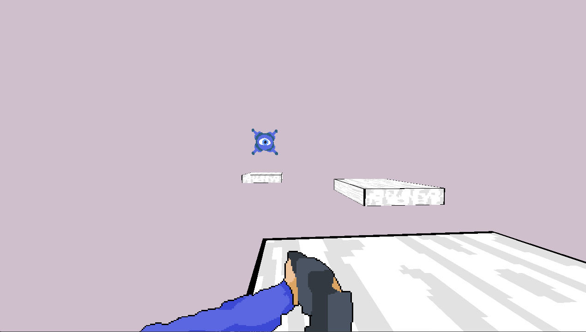
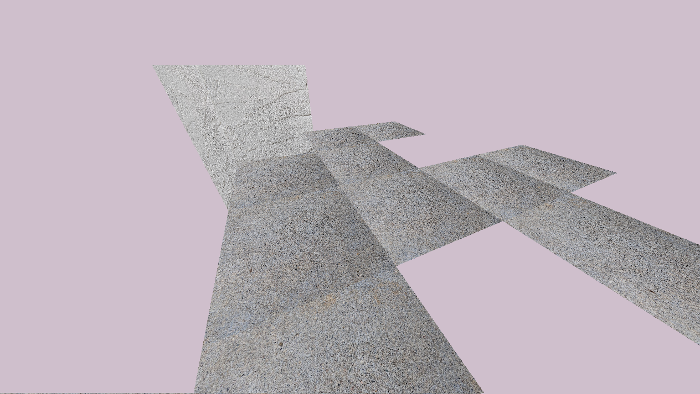

## 3D Renderers using GLM

### I have programmed a variety of different 3D renderers using C++, OpenGL, and GLM.

**Tech:** `C++` `OpenGL` `SDL2` `GLM`

*A 3D platformer project with some billboard sprites for the enemy.*

*A quick draw call batching project I did as an attempt to create a 3D map from a 4x4 array.*

[View Source Code](https://github.com/storm453)