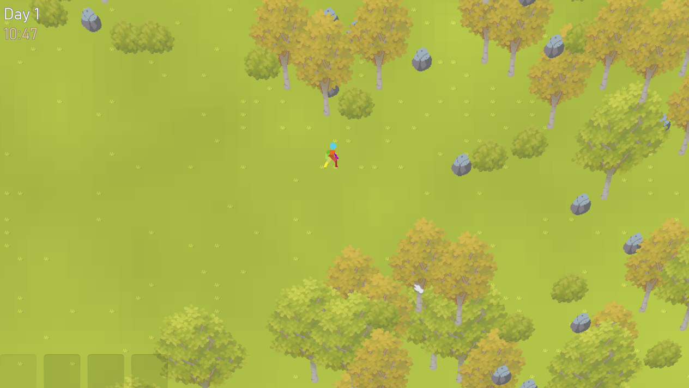
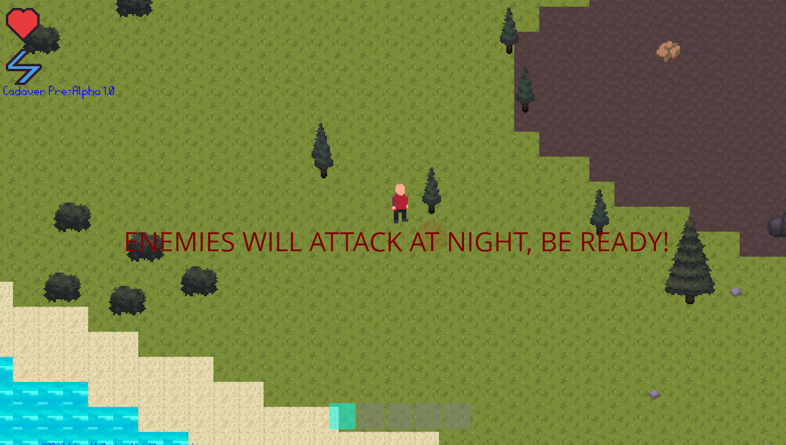

## Cadaver

### My first major project ended up being a 2D survival game made in GameMaker Studio 2.

2020 - 2023

**Tech**: `GameMaker Studio 2` `GameMaker Language`

|  |  |
| :---: | :---: |
| *The game in its current playable state. The game has seen multiple asset and codebase changes over the years.* | *A screenshot of the first playable alpha build of Cadaver.* |

## Motivation Behind the Project

I have long called Cadaver my dream game. When will it be done? I can't answer that, all I can say for sure is that I love working on it.

I made Cadaver because the thought of creating my own survival and crafting game filled me with joy.

## Key Features

While the Cadaver project was an important part of me learning several basic but extremely important game development skills, it eventually evolved into a technical powerhouse of a GameMaker project. 

Technical implementations:

* Procedural chunk based infinite generation
* A modular component based system which allows entities to share a unified health and physics system
* Emergent gameplay such as enemies attacking enemies and environmental damage without hardcoded cases
* Custom sprite rendering which skews the vertices of a sprite to simulate 3D perspective

## What are my plans going forward?

I am no longer interested in fully developing a game in GameMaker Studio 2. While I appreciate the engine for prototypes and quick learning projects, I will not be using it to finish Cadaver.

## Source Code & Repository

[View Source Code](https://github.com/adam-mathe/cadaver.git)