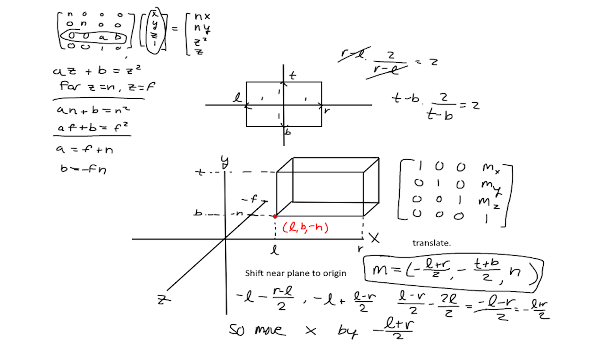

## Rainstorm Framework

### Rainstorm is a 2D framework I am currently developing without the use of an external math library.

2026 - Present

**Tech:** `C++` `OpenGL` `SDL2`


*A screenshot of the first time my perspective projection matrix from hand worked.*



*Some scribbles I made to understand and derive the orthographic projection matrix.*

## Why did I make it?

Coming into this project I had a decent amount of experience with C++ and OpenGL, but I relied on GLM for matrix math.

With Rainstorm 2D, my goal is to learn the linear algebra behind graphics programming math by deriving and implementing each function by hand.

## What have I implemented?

In the project so far, I have developed a matrix library which includes:
* Matrix multiplication
* Scaling matrices
* Translation matrices
* Rotation matrices
* Orthographic projection matrices

<details markdown="1">

<summary><strong>View Example Rendering Loop Code</strong></summary>

> *Example code for the framework, renders a 32 x 32 pixel square in the middle of a 1280 x 720 px screen.*

```c++
int main()
{
    init_window(&game.window);

    if (!gladLoadGLLoader(SDL_GL_GetProcAddress)) 
    {
        throw(std::string("Failed to initialize GLAD"));
    }

    unsigned int program = rain::shaderProgram(vertex_shader_source, fragment_shader_source);
    
    unsigned int vao;
    
    glGenVertexArrays(1, &vao);
    glBindVertexArray(vao);
    
    float entity_vertices[] =
    {
        //vertices
         0.5,  0.5, -0.7, //move z back to test perspective proj matrix
        -0.5,  0.5, -0.7,
        -0.5, -0.5, -0.5,
         0.5, -0.5, -0.5,
    };

    unsigned int entity_indices[] =
    {
        0, 1, 2,
        0, 2, 3,
    };

    unsigned int entity_vbo, entity_ebo;

    glGenBuffers(1, &entity_vbo);
    glGenBuffers(1, &entity_ebo);

    glBindBuffer(GL_ARRAY_BUFFER, entity_vbo);
    glBufferData(GL_ARRAY_BUFFER, sizeof(entity_vertices), entity_vertices, GL_STATIC_DRAW);

    glBindBuffer(GL_ELEMENT_ARRAY_BUFFER, entity_ebo);
    glBufferData(GL_ELEMENT_ARRAY_BUFFER, sizeof(entity_indices), entity_indices, GL_STATIC_DRAW);

    glVertexAttribPointer(0, 3, GL_FLOAT, GL_FALSE, 3 * sizeof(float), (void *)0);
    glEnableVertexAttribArray(0);

    while(game.window.running)
    {
        update_window(&game.window);

        glClearColor(0.5f, 0.5f, 0.5f, 1.0f);
        glClear(GL_COLOR_BUFFER_BIT);

        glBindBuffer(GL_ARRAY_BUFFER, entity_vbo);
        glBindBuffer(GL_ELEMENT_ARRAY_BUFFER, entity_ebo);
        
        //draw a tile
        glUseProgram(program);

        rain::Mat model = rain::identity();

        rain::Mat projection = rain::identity();
        rain::ortho(projection, -640.0f, 640.0f, 360.0f, -360.0f, 0.1f, 100.0f);
        rain::scale(model, vector3(32.0f, 32.0f, 1.0f));

        rain::setConstant(program, "model", model);
        rain::setConstant(program, "projection", projection);

        glDrawElements(GL_TRIANGLES, 6, GL_UNSIGNED_INT, (void*)0);
        
        SDL_GL_SwapWindow(game.window.window);
    }
    
    SDL_GL_DeleteContext(game.window.context);
    SDL_DestroyWindow(game.window.window);

    return 0;
}
```

</details>

## What are my plans going forward?

As this project continues, I plan to derive and implement arbitrary axis rotation completely on my own and implement a more stable projection matrix.

## Source Code & Repository

[View Source Code](https://github.com/storm453/rainstorm-framework.git)