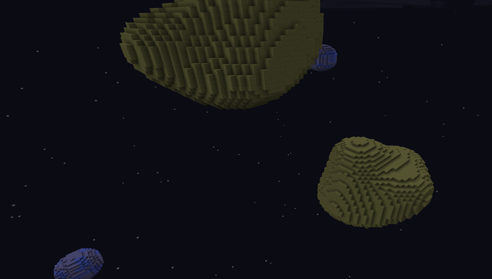
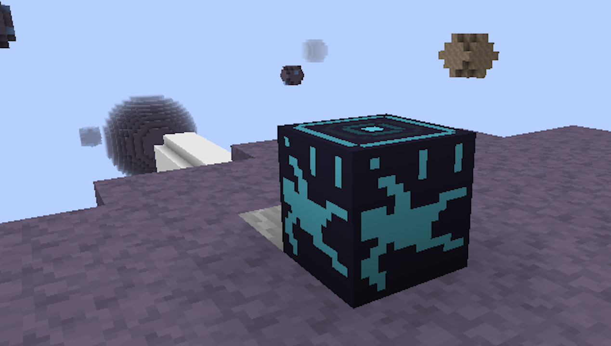

## Space Survival

### Space Survival is a custom survival experience developed for Minecraft using Java and the Spigot API.

2025

**Tech:** `Java` `Spigot`

|  |  |
| :---: | :---|
| *Custom world generation to generate asteroids using noise which replaces Minecraft's standard world generation process.*| *A custom block which listens for an EntityDamageEvent and intercepts it, negating player fall damage.* |

## Motivation Behind the Project

Me and one of my close developer friends, [Sherwin](https://sherwinsalemi.com/) have long wanted to develop a multiplayer game together. We found Minecraft to be the perfect environment to build our project in as it provided us with an easily modifiable multiplayer experience.

## Key Features

In the project we implemented:

* A brand new way to play the game featuring custom items, crafting recipes, world interactions, and game mechanics like an oxygen meter
* Custom world generation in the form of asteroids in space, featuring various random layers of different materials
* CI/CD game resources using GitHub actions

## What are my plans going forward?

The project is currently on hiatus as Sherwin recently began his first year of university and we no longer have time to work on the project collectively as a group.

## Source Code & Repository

[View Source Code](https://github.com/Space-Survival-Dev/spacesurvival)